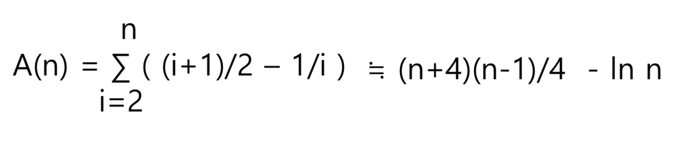
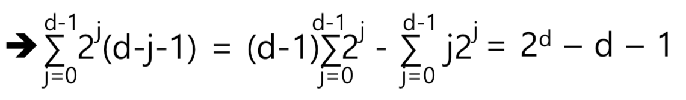
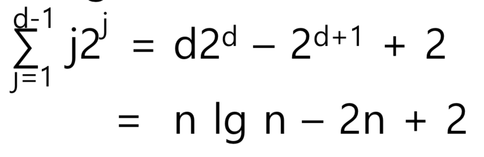

# The Sorting Problem

θ(n) average case time complexity인 sorting algorithm은 없나? → 없음

# Computational Complexity

lower bound on the efficiency of **all algorithms** for a given problem → 제일 좋은 알고리즘을 썼을 때 얼마나 빨리 풀릴 수 있냐?

Ω(n lg n) is lower bound for algorithms that sort by comparing keys

# Insertion Sort

existing sorted array에 key를 삽입해서 정렬하는 알고리즘

1. 정렬된 (i-1) array에 `x`를 끼워넣음
2. `x`를 바로 앞인 `S[i-1]`, `S[i-2]`와 비교함 → `x`보다 작은 key를 찾을 때까지
   - 여기서 `j`가 가장 작은 인덱스 → `j`의 다음 칸에 `x`가 들어감
3. `S[j+1]`부터 `S[i-1]`까지 한 칸 씩 다 뒤로 밀어서 자리를 확보한 후 그 자리에 `x`를 넣는다
4. 이 과정을 i=2에서 i=n까지 반복

```cpp
void insertionSort(int n, keyType[] S) {
	index i, j;
	keyType x;

	for(i=2; i<=n; i++) {
		x = S[i]; // 현재 비교할 대상
		j = i - 1; // 현재 비교대상의 바로 전 인덱스로 초기화

		while(j > 0 && S[j] > x) { // 이전 요소가 현재 비교대상보다 크다면
			S[j+1] = S[j]; // 이전 인덱스를 다음 인덱스에 밀어서 공간을 만듦
			j--; // 현재 비교대상보다 큰 놈이 더 있을 수 있으니까 인덱스 줄이면서 반복
		}

		S[j+1] = x; // 루프문 나와서 [최종적 현재 비교대상보다 작은 인덱스+1] 위치에 현재 비교하고 있는 대상 x를 넣음
	}
}
```

## Worst Case Time Complexity

already **sorted**,but in the **reverse order**

i는 2부터 n-1까지 다 비교해서 확인해야 함 (2 ≤ i ≤ n)

**W(n) = ∑ ( i – 1 ) = n(n-1)/2**

## Average Case Time Complexity

[1+2+3+ … +(i-1)+(i-1)] / i

= [i(i-1)/2 + (i-1)] / i

= (i+1)/2 - 1/i



# HeapSort

<aside>
💡 Heap

- essentially complete binary tree
- 부모 노드가 자식 노드보다 큼 (Heap Property)
</aside>

heap property를 유지하면서 root에 있는 key(최댓값)를 반복적으로 제거함

removed key를 nth slot에서 시작해 first slot으로 내려가는 array에 넣음

**→ need to figure out**

- How to construct the initial heap
- How to remove the keys while maintaining the heap property

## ☑️ How to construct the initial heap

1. essentially complete binary tree로 만듦 with the S[1] as the root key
2. essentially complete binary tree를 heap으로 만듦
   - level-d subtrees를 heaps로 먼저 만들고, (마지막 레벨(leaf node)이니까 heap 성질 충족)
   - level d-1 subtrees를 그 다음으로 heaps로 만들고… (자식과 비교해서 더 큰 걸 위로 올림 + 내린 상태에서도 아래 leaf node까지 내린 것보다 큰 게 있는지 확인하고 있으면 자리를 바꿈)
   - whole tree가 heap이 될때까지 계속 변경 (작은 것(제일 마지막 레벨인 d레벨)부터 ~ 큰거 순서로)

## ☑️ How to remove the keys while maintaining the heap property

1. root key 지운 다음 root key에 last key at the bottom을 이동시킴
   - 지운 root level의 데이터는 array의 제일 n번째(제일 끝) 슬롯에 넣음
2. 그 작은 수(last key at the bottom)를 heap property가 restored되게끔 내림(sift)

## Implementation of HeapSort

```c
public static void heapSort(int n, heap H, keyType[] S) {
	makeHeap(n, H);
	removeKeys(n, H, S);
}

public static void makeHeap(int n, heap H) {
	index i;
	heap Hsub;

	// 가장 마지막 depth는 그 자체로 heap이기 때문에 depth(H)-1로 설정
	// 줄여가면서 위로 올라감. 이 과정에서 heap으로 만듦
	for(i=depth(H)-1; i>=0; i--) // d: depth of the tree
		for (all subtrees Hsub whose roots have depth i) // depth i를 가진 root를 가진 subtree를 heap으로 만듦
			shiftDown(Hsub); // root를 자식들과 비교해서 계속 내려가는 것
}

public static void siftDown(heap H) {
	index parent, largerChild;

	parent = root of H;
	largerChild = parent's child containing larger key; // parent의 두 child 중 더 큰 걸 저장

	while (key at parent is smaller than key at largerchild) { // parent와 largerChild를 비교해서 더 작을 경우에만 바꿈
		exchange key at parent and key at largerChild;
		parent = largerChild; // paren index에 largerChild를 넣음
		largerChild = parent's child containing larger key; // 새로 parent가 된 노드는 다시 자식 노드와 비교되어야 함
		// largerChild의 위치로 바뀐 parent보다 큰 수를 가지고 있는 자식이 largerChild로 재정의, 반복
	}
}

public static void removeKeys(int n, heap H, keyType[] S) {
	index i;
	for(i=n; i>=1; i--) // 내려가면서 root를 제거한 다음, root를 S[i] 위치에다 넣는 걸 반복
		S[i] = root(H);
}

public ststic keyType root(heap H) {
	keyType keyout;
	keyOut = key at the root;

	// root를 제거, 맨 아래 노드를 루트로 옮김
	move the key at the bottom node to the root;
	delete the bottom node;
	// heap property 갖도록 정렬
	siftDown(H);

	// S[i]에 저장하기 위해 지운 root 리턴
	return keyOut;
}
```

## Worst Case Time Complexity of HeapSort

- Basic Operation: siftDown에서의 key 비교
  - makeHeap과 removeKeys 둘 다 siftDown을 호출하니까 둘 다 분석
- Input Size: n (the number of keys to be sorted)
- Assumption = n = 2^d

### makeHeap

| Level | # of nodes | Greatest # of nodes that a key would be sift |
| ----- | ---------- | -------------------------------------------- |
| 0     | 1          | d-1                                          |
| 1     | 2^1        | d-2                                          |
| …     | …          | …                                            |
| j     | 2^j        | d-j-1                                        |
| …     | …          | …                                            |
| d-1   | 2^(d-1)    | 0                                            |



- 노드 갯수 2^j개
- (최악의 경우) 비교 횟수: 각 노드가 d-j-1번

2^d - d - 1 + d = 2^d - 1

- +d한 이유는 없다고 가정한 마지막 노드 → 해당 세로 라인 총 비교횟수

**= n - 1**

### removeKeys

루트에 있는 걸 빼내고 제일 아래 있는 걸 루트에 갖다 붙인 후 → siftDown 과정에서 다시 비교가 일어남

- root부터 d-1 level까지 비교해야 할 노드 갯수: 2^(d-1)
- (최악의 경우) 비교 횟수: 각 노드가 d-1번
- → d-1 레벨에서 siftDown하는 총 노드 갯수는 (d-1)\*2^(d-1)

모든 레벨(from d-1 to 1)의 경우 **n lg n - 2n + 2**



# Lower Bounds for Sorting Only by Comparisons of Keys

## Decision Trees for Sorting Algorithms

```cpp
void sortTree(keyType[] S) {
	keyType a, b, c;
	a = S[1];
	b = S[2];
	c = S[3];

	if(a < b) {
		if(b < c)
			S = a, b, c;
		else if(a < c)
			S = a, c, b;
		else
			S = c, a, b;
	}else if(b < c) {
		if (a < c)
			S = b, a, c;
		else
			S = b, c, a;
	}else {
		S = c, b, a;
	}
}
```

```cpp
void exchangeSort(int n, keyType[] S) {
	index i, j;
	// a=S[1]; b=S[2]; c=S[3];

	for(i=1; i<n; i++) {
		for(j=i+1; j<=n; j++) {
			if(S[j] < S[i])
				exchange S[i] and S[j];
		}
	}

}
```

### Lemma 7.1:

n개의 distinct keys를 sort하는 알고리즘이라면 → valid(정확히 분류를 잘 해내는) decision tree의 모양은 → **n! leaves** node를 가지고 있어야 한다.

### Lemma 7.2:

- worst case 비교의 수는 depth와 같다
- keys의 비교로 n개의 distinct keys를 sort하는 알고리즘이라면 → worst case는 적어도 **ceiling(lg(n!))**번의 keys 비교를 한다.

### Lemma 7.3:

**d ≥ ceiling(lg m)**

- m: binary tree의 leaves의 수
- d: depth

### Lemma 7.4:

모든 positive integer n에 대해,

**lg(n!) ≥ n lgn - 1.45n**

### 결론

비교 횟수는 적어도 ceiling(**n lgn - 1.45n**) 보다는 커야 한다

n lgn보다 더 좋은 sorting 알고리즘을 발견할 수 없다를 증명
