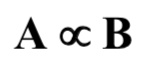

# ☑️ Intractability

**intractability:** 계산 불가능. 풀기 어려운 문제를 intractable하다고 함

## Polynomial-Time Algorithm

<aside>

💡 An algorithm such that W(n) ∈ O(p(n)) (p(n), a polynomial)

</aside>

**ploynomial보다 작거나 같은 Worst case time complexity를 가지는 알고리즘**

- Polynomial: 다항식
  - 2n, 3n^3 + 4n, 5n + n^10, n lg n…
  - 2^n은 polynomial이 아님
- Example of polynomial-time algorithm
  - Insertion Sort (n^2)
  - Sequential Search (n)

## Intractable Problem

ploynimial-time algorithm으로 풀기가 불가능한 problem

# ☑️ The Three General Categories of Problems

1. Polynomial-time algorithm이 존재하는 problem
   - Sorting, Shortest Paths Problem, Minimum Spanning Tree Problem etc.
   - 시간 안에 풀 수 있는 알고리즘
2. intractable하다는 것이 증명된 problem
   1. polynomial보다 훨씬 많은 output을 출력해야 하는 문제
      - printing all permutations of n keys (n!)
   2. Undecidable problem
      - Halting Problem
3. intractable하다는 것이 증명되지 않았지만 / polynomial-time algorithm이 발견되지도 않은 problem
   - The 0-1 Knapsack Problem,
   - The Traveling SalesPerson Problem
   - The m-coloring Problem (m > 2)

# ☑️ Theory of NP

## ✔️ Decision Problem

답이 yes/no로만 나오는 problem

모든 optimization problem을 decision problem으로 만들 수 있음

- The Traveling SalesPerson **_Decision_** Problem
  - Given d>0, determine whether there is a tour having total cost ≤ d
- The 0-1 Knapsack **_Decision_** Problem
  - Given R>0, determine if it is possible to load the
    knapsack so that its total profit > R. (total weight ≤ W)

## ✔️ The sets P and NP

### Definition: P

- decision problem들의 집합 / polynomial-time algorithm으로 풀리는
- 예시:
  - is a key in an array? ∈ P
  - is an array sorted? ∈ P
- TSP decision problem이나 0-1 Knapsack decision problem은 P에 속하냐? → 속하는지 속하지 않는지 **모른다**

### Definition: Verification

- 주어진 decision problem이 정말로 solution이 되는지 체크하는 과정
- Verification 과정은 문제를 푸는게 아니라, 이게 solution이 된다/안된다만 판단
- 예시: The T.S.P. Decision Problem
  ```c
  bool verify(weighted_digraph G, number d, claimed_tour S) {
  	if (S is a tour && the total weight of the edges in S <= d)
  		return true;
  	else
  		return false ;
  }
  ```
  → Polynomial Time (O(n))

### Definition: Nondeterministic Algorithm

deterministic algorithm은 순서가 정해져 있는 알고리즘. nondeterministic은 순서가 정해져 있지 않고 그냥 아래와 같이 풀 수 있는 알고리즘

An algorithm with the following stages:

1. **_Guessing_ (_Nondeterministic_) :**
   - 어떤 솔루션 S를 하나 찍음 이게 답 yes가 나오는지, 되는지 해보자
2. **_Verification_ (_Deterministic_) :**
   - 진짜 되는지(정말 솔루션이 되는지) 해봄
   - deterministic algorithm으로 풀림
     - eventually halting with “true”
     - halting with “false”
     - not halting at all (i.e. infinite loop)

### Definition: “Solve”

아래와 같은 경우 nondeterministic algorithm이 “solve” a decision problem했다고 함

1. For any instance for which the answer is “**yes**”,
   there is **some** string S for which the verification stage returns “**true**” (guess & verify로 true가 나오는 경우가 한 개 이상 존재)
2. For any instance for which the answer is “**no**”,
   there is **NO** string S for which the verification stage returns “**true**” (guess & verify로 모든 경우가 다 true가 나오지 않음)

### Definition: NP

<aside>

💡 **Polynomial-time nondeterministic algorithm**

**: verification 단계가** **polynomial-time algorithm인** nondeterministic(순서가 정해져 있지 않은) algorithm

</aside>

Polynomial-time nondeterministic(순서가 정해져 있지 않은) algorithm으로 풀리는 decision problems(답이 yes/no로만 나오는 problems)

- The Traveling SalesPerson **_Decision_** Problem
- The 0-1 Knapsack **_Decision_** Problem
- All problems in P
  - No one knows whether or not NP-P is empty

## ✔️ NP-Complete Problems

Informal Definition: any member of S가 P에 풀린다면, 모든 다른 member들도 다 P에 풀리는 / NP에 속하는 문제들의 그룹(집합) S

NP 중에서도 가장 어려운 문제들(이걸 P에 풀면 당연히 다른 것도 P에 풀린다)을 모아놓은 것

Examples:

- The Traveling SalesPerson **_Decision_** Problem
- The 0-1 Knapsack **_Decision_** Problem
- The CNF Satisfiability Problem (NP-Complete Problems의 출발점이 된 문제 → 완전히 이해할 필요는 없고 간단히 알아두기)

### The CNF Satisfiability Problem

- **Literal:** logical variable(true/false 값이 나오는 논리변수) or the negation of a logical variable
- **Clause:** literal들을 OR로 연결한 한 개의 덩어리
- **Conjunctive Normal Form(CNF):** clause들이 AND로 연결된 것
- **CNF Satisfiability Problem:** expression in CNF를 true로 만드는 assignment가 존재 하냐 안하냐의 문제
  - AND로 연결됐으니까 모든 clause들이 true로 나와야 함
  - clause 내부의 literal 중 하나는 true가 나와야 함
- P로 풀 수 있을 것 같은데 못 풀었음 → NP에 해당함. P에 속하는지는 No one knows.

### Transformation Algorithm

decision problem(답이 yes/no) A를 풀고 싶은 상황에서 / decision problem B를 푸는 알고리즘을 가지고 있다고 가정

A의 instance x를 → B의 instance y로 바꿔서 그 instance를 푼 결과 → A의 x가 yes/no로 나올 것으로 예상했는데 그대로 yes/no가 나오고 B도 똑같이 yes/no로 일치하는 알고리즘

→ 이 경우 A problem을 푸는 알고리즘이라고 볼 수 있음

---

**Example:**

- Problem A: Given an array of n integers → array의 반쪽에서 뒷부분 반쪽에 최솟값이 들어있는지? (smallest in the latter half of the array)
- Problem B: Given an array of n integers → array의 반쪽에서 뒷부분 반쪽에 최댓값이 들어있는지?
- 두 문제는 consistent하지 않고 독립적이지만, B를 푸는 알고리즘으로 A를 풀 수 있음
- instance들에 다 마이너스를 붙이고, A의 instance x를 -x로 transformation
  - 이렇게 하면 B 문제의 최댓값 찾는 알고리즘을 활용해 풀 수 있음
  - A의 경우와 B의 경우 모두 같은 yes/no 답이 나오게 됨
  - 마이너스로 바꾸는데 polynomial-time이 걸림 → B를 polynomial로 풀 수 있다면, A 역시 polynomial로 풀 수 있음

### **Polynomial-time Many-One Reducibility**



- B의 알고리즘을 이용해 A를 풀 수 있다
- A is reducible to B (A reduces to B)
- B를 풀면 A도 풀리니까 → B가 더 어려운 문제라고 할 수 있다.

<aside>

💡 **Theorem 9.1:**

If decision problem B is in P(polynomial-time으로 풀리면서), A reduces to B라면
→ then decision problem A is in P(polynomial-time으로 풀린다)

</aside>

<br />

**이게 NP-Completeness와 무슨 관련이 있냐?**

- B 알고리즘을 풀면 다른 NP문제를 풀 수 있는 경우 → problem B를 NP-Complete Problems이라고 한다

### **Throrem 9.1:**

if any NP-complete problem is in P(polynomial-time으로 풀린다면), → then P=NP (모든 다른 것들도 polynomial-time으로 풀리기 때문에 P=NP임이 증명됨)

**Throrem 9.2 - Cook’s Throrem:**

CNF-Satisfiability가 NP-complete을 증명한 최초의 문제

### **Throrem 9.3:**

A problem C is NP-complete if

1. It is NP and
2. For some other NP-complete problem B, B reduces to C

**Proof:**

- B is NP-complete, for any problem A in NP, A reduces to B
- Then A reduces to C
- Because C is in NP, by definition, C is NP-complete

## ✔️ The State of NP

1. P ⊆ NP, but don’t know whether NP - P = **∅**
2. set NPc (of all NP-complete problems) ⊆ NP
   - ⊂도 맞음.
   - trivial decision problem(모든 instance에 yes라고 나오는 문제)은 NP지만 NP-complete는 아님
3. If P=NP → NPc ⊂ P
   If P ⊂ NP → NPc **∩** P = **∅**

## ✔️ NP-Hard Problems

Informal definition: NP-complete problems만큼 hard한 problems

- Doesn’t have to be in NP
  - decision problem(답이 yes/no로만 나옴)이 아니어도 됨
- All problems in NP reduce to any NP-hard problem
- If a polynomial-time algorithm exists for any NP-hard problem → P=NP
- Any optimization problem(최댓값, 최솟값 구하기) corresponding to any NP-complete decision problem is NP-hard
