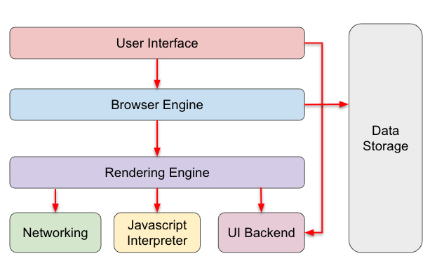

# 웹 브라우저의 동작

> 해당 문서는 https://anneslab.tistory.com/118?utm_source=oneoneone 아티클을 읽고 개인적인 학습 목적으로 정리한 것입니다.

<br />

## ✔️ 웹 브라우저의 구조



- **User Interface:** 웹 URL을 보여주는 주소 표시 줄, 앞/뒤로 가기, 새로고침, 북마크 표시줄 등
- **Browser Engine**
  - UI와 Rendering Engine 사이의 동작을 제어
  - 주어진 URL을 읽어들이며, 앞/뒤 페이지로 가거나 새로고침을 하는 등 기초적인 액션 담당
  - **Data Persistence:** local/session storage, cookie 등 보조기억장치에 데이터 저장
- **Rendering Engine**

  - HTML, CSS 등을 해석해주는 엔진
  - 네트워크 계층의 데이터를 처리하고 웹 컨텐츠를 화면에 표시
  - Gecko, Trident, WebKit 등 다양한 렌더링 엔진 존재

<br />

- **Networking:** HTTP request 등 네트워크 통신 담당
- **JavaScript Interpreter:** 자바스크립트 코드의 해석 및 실행 (V8 엔진 등)
- **UI Backend:** OS에서 제공하는 UI 메서드를 사용해 버튼, 콤보박스 등 기본적인 위젯을 그려줌

<br />

여기서 집중할 건 렌더링 엔진으로, HTML 마크업과 CSS 스타일을 해석해서 화면에 그려내는 역할을 한다.

<br />

## ✔️ 렌더링 엔진의 종류

어떤 렌더링 엔진을 쓰는지는 웹 브라우저마다 다르고, 각 엔진도 동작 과정이 조금씩 다르다.

크롬과 대부분의 최신 브라우저의 경우 각 탭마다 별도의 렌더러 프로세스(브라우저 탭 안에서 일어나는 모든 일들을 담당)가 돌아가고 있어, 여러 개의 탭을 열 경우 각각의 렌더링 엔진이 동작해 해당 탭의 내용을 표시한다. 그렇기 때문에 한 탭이 죽더라도 다른 탭은 멀쩡히 살아남을 수 있는 것!

**1. Webkit (Safari)**

- Apple에서 개발
- Safari, iOS 브라우저에서 사용하며, 크롬도 Blink 엔진 탑재 전 해당 엔진을 사용

**2. Blink (Chrome, Whale, Samsung Internet, Edge)**

- Google에서 개발, WebKit에서 파생된 엔진 (Chromium 28 버전부터 적용)

**3. Trident (Internet Explorer)**

- Microsoft에서 개발, Internet Explorer에서 사용되었지만 웹 표준 미준수 + 각종 버그 + 보안 문제 등으로 지금은 사용되지 않음

**4. EdgeHTML (Edge)**

- Microsoft에서 개발, Trident 이후 Edge에서 사용되던 엔진이었지만 2019년부터 Edge 브라우저를 Chromium 기반으로 재구축하면서 사용되지 않음

**5. Gecko (Firefox)**

- Mozilla에서 개발

<br />

# 웹 브라우저가 화면을 그려내는 과정

<span style="color:grey"> \* Chrome의 아티클 기반 - Chromium이나 Blink에만 해당하는 내용이 있을 수 있음 </span>

> [!TIP]
>
> **주요 렌더링 경로 (CRP; Critical Rendering Path)**
>
> 1. HTML 해석(파싱) 후 DOM 트리 구성
> 2. CSS 해석(파싱) 후 CSSOM 트리 구성
> 3. DOM + CSSOM 결합하여 Render 트리 구성
> 4. 레이아웃 계산
> 5. 페인팅 및 레이어 합성

<br />

## 1️⃣ HTML 파싱

파싱(Parsing): 문서를 해석하고 구조화된 데이터로 바꾸는 것
<br/>
= 마크업을 렌더링하기 위한 형태로 바꾸는 단계

1. 렌더러 프로세스의 메인 스레드는 HTML 문서의 원시 바이트를 읽은 다음
2. 정해진 파일 인코딩에 맞춰 각각을 문자로 전환한다.
3. 그러면 꺽쇠(`<>`)로 묶인 문자열을 읽게 된다.

4. 브라우저는 `<html>`이나 `<head>`같은 W3C HTML5 표준에 규정된 문자열들을 쪼개서 **토큰(Token)** 으로 만든다.  
   <span style="color:grey">예를 들어, `<html>`이 나오면 html 시작 토큰을 만들고, `</html>`를 보면 html 종료 토큰을 만드는 것과 같다. 여기에는 태그 뿐만 아니라 속성(`class` 등)이나 텍스트 같은 HTML 요소가 포함된다.</span>

5. 이렇게 문서를 토큰화했으면, 만든 토큰을 가지고 구조화를 한다.  
   <span style="color:grey">`<html><head></head></html>`에서 head 종료 토큰은 html 종료 토큰 전에 존재하기 때문에 head는 html의 자식이라고 판단하는 식으로 구조화를 한다.</span>

6. 토큰을 파싱해 구조를 만들었으면 -> 각 토큰은 해당하는 **노드(Node)** 로 변환된다.

   - 노드는 부모-자식이라는 계층적 관계를 통해 문서의 구조를 표현해내는 요소이다.
   - HTML 문서의 모든 것은 노드가 되어 구조를 형성한다. 태그는 요소 노트(Element Node)가 되고, 그 안에 적은 건 텍스트 노드가 된다. DOCTYPE 선언이나 주석까지 모두 노드!

7. 노드는 계층 형태(노드 트리 = DOM 트리)로 구조화된다.

   - 처음 생성되는, 가장 상위에 있는 노드인 `document`를 Root라고 부른다. 참고로 텍스트 노드처럼 자식을 가질 수 없는 노드는 leaf라고 부른다.
   - 개발자들은 Root(document node)를 진입점으로 문서 내 다른 DOM 요소들을 탐색하고 조작할 수 있다.
     <br />

> [!TIP]
>
> ### DOM (Document Object Model)
>
> DOM은 말 그대로, 문서(Document)를 객체(Object) 기반으로 표현한 모델(Model)이다.
>
> HTML, XML 등의 문서 내 요소를 객체로 표현해 프로그래밍 언어에서 조작할 수 있게 하는 인터페이스를 제공한다.
>
> DOM API를 통해 DOM 객체를 조작할 수 있다. 만약 span 텍스트를 바꾸고 싶다면 `document.body.getElementsByTagName('span')[0].innerText = 'Hello'`로 접근해 조작하면 된다.
>
> <br />
>
> > - **DOM Object**  
> >   DOM에서 문서와 관련된 객체
> >
> >   - 접근하고 조작하기 위한 인터페이스를 제공한다.
> >   - 프로그래밍적으로 접근하고 조작할 수 있는 객체의 개념이다.
> >
> > - **DOM Node**  
> >   DOM Tree(=Node Tree)를 구성하는 온갖 노드들
> >
> >   - 트리 구조를 통해 서로 간의 계층적 관계를 나타낸다.
> >   - 문서를 표현하는 각 콘텐츠를 지칭하는 개념이다.
> >
> > - **DOM Element**  
> >   DOM Node 중에도 태그로 표현되는 요소들(`div` 등)을 Element Node라고 하는데, 이들을 부르는 다른 말이 DOM Element
>
> <br />
>
> 즉, DOM은 트리 구조로 웹페이지를 표현하며, DOM 트리를 이루는 구성요소가 노드이다.
>
> DOM은 CSSOM과 결합해 Render 트리를 만들며, 브라우저는 이걸 통해 화면을 그려낸다.
>
> - 따라서 **DOM은 실제로 화면에 보여지는 것과 일치하지 않는다**.  
>   <span style="color:grey"> ex) `display:none`처리한 요소는 화면에 보이지 않지만 DOM에는 존재하며, `:after` 같은 가상요소는 렌더링되었지만 DOM 객체가 아니므로 자바스크립트로 조작하는 것이 불가하다. </span>
>
> - DOM이 HTML과 완전히 일치한다고 할 수도 없다. 브라우저는 우리가 닫는 태그를 빼먹고 썼어도 DOM을 구성해주기 때문이다.
>
> - DOM은 자바스크립트의 영향을 받을 수 있다.  
>    `appendChild()` 메서드로 DOM을 추가하는 것도 가능하다. → 자바스크립트에 의해 DOM 파싱은 방해받을 수 있다.

<br />

## 2️⃣ CSS 파싱

CSS도 파싱 과정을 거쳐 Bytes → Characters → Tokens → Nodes → Object Model(CSSOM)로 만들어진다.

CSSOM은 CSS 문서를 객체로 나타내고 조작하기 위한 인터페이스를 제공하는 웹 표준으로, DOM과 마찬가지로 트리 형태로 구조화되어 있다.

- CSS(Cascading Style Sheets)의 "C"는 캐스케이딩(Cascading; 위에서 아래로 쏟아지는, 상속 또는 종속하는)이다.  
  **스타일 규칙은 계단식으로 상속**된다.

  - 브라우저가 트리 구조를 따로 각 노드에 적용할 수 있는 일반적인 규칙부터 시작해 내려가면서 추가적인 스타일을 적용함

- 브라우저들은 저마다 기본으로 제공하는 **내장 속성 스타일도 고려해** CSSOM 트리를 구성한다.

  - <span style="color:grey"> 개발자 도구를 열어보면 정의하지 않은 속성이 user agent stylesheet에서 적용된 걸 확인 가능! → reset 등으로 재정의해서 쓰기 편하게 바꾸곤 한다. </span>

- **RTL(Right-To-Left) 파싱 / 상향식 파싱**

  - 브라우저는 CSS를 빠르게 파싱하기 위해 셀렉터의 오른쪽(자식)에서 왼쪽(부모)으로 거슬러 올라가면서 읽는다.

  <br />

  > ```css
  > header div h1 p span {
  >   color: red;
  > }
  > header span.text {
  >   color: red;
  > }
  > ```
  >
  > 위에서 후자의 코드가 스타일을 계산할 때 좀 더 빠르다.
  >
  > - 전자는 span~p,h1 거슬러 올라가 header까지 일치하는지 브라우저가 DOM 트리를 순회하면서 요소를 확인한다.
  > - 후자는 클래스 셀렉터를 쓰고 있어 DOM 트리를 탐색할 필요 없이 렌더링 엔진이 알아서 빠르게 인덱싱한다.
  >
  > <br/>

  - CSS를 파싱할 때 오른쪽(자식)부터 시작해서 일치하지 않는지 빠르게 판단하면 나머지 셀렉터(부모)는 읽지 않고 다음 판단으로 넘어갈 수 있다. (→ 왼쪽(부모)부터 읽을 경우 DOM 트리 탐색을 위해 전체 HTML을 스캔해야 함)

  - 각 브라우저별 렌더링 엔진이 가진 최적화 기술도 RTL 파싱에 적합한 매커니즘을 갖고 있다.

  - But 모던 브라우저는 성능이 좋아져서 셀렉터 최적화에 너무 매달릴 필요는 없을 것 같다.

<br />

## 3️⃣ 렌더 트리 구성

렌더 트리는 화면에 실제로 표시되는 시각적 요소를 계층적으로 나타낸 것  
ROM(Render Object Model)이라 부르기도 한다.

브라우저는 아래와 같은 단계를 거쳐 렌더 트리를 구성한다.

1. DOM 트리의 루트(document)에서 시작해 렌더링할 노드를 찾아낸다.
2. 각 노드에 일치하는 CSSOM 규칙을 찾아 적용한다.
3. 콘텐츠와 스타일을 결합해 가시적인(visible) 노드를 구성한다.

<br />

> [!IMPORTANT]  
> **눈에 보이는 시각적 요소만 포함**한다는 점이 핵심이다.
>
> - `display:none`이 적용된 DOM 요소나 `<html>`, `<head>`는 시각적인 내용이 없기 때문에 화면에 렌더링되지 않고, 렌더 트리에 포함되지 않는다.
>
> - `:before`, `:after`로 만든 가상 요소는 DOM 요소는 아니지만 화면에 렌더링되므로 렌더 트리에 포함된다.

<br />

## 4️⃣ Layout 설계

브라우저는 렌더 트리의 루트부터 시작해 각각의 정확한 위치와 크기를 알아낸다. 예를 들어 `width: 50%`는 250px이고, `font-size: 4em`은 22이군.. 하는 식으로 정확하게 파악하는 것!

1. 브라우저는 박스 모델에 따라 페이지에서 노드가 차지하는 박스를 만들고,
2. 이를 트리 형태로 구조화한 후
3. **각 박스의 크기와 위치를 계산해** 페이지의 레이아웃을 구성한다.

<br />

## 5️⃣ 화면에 그리는 Painting

레이아웃 단계가 끝나면 **렌더링 트리를 화면의 픽셀로 변환하는 Paint 이벤트가 실행된다.**

여기서도 브라우저는 화면에 그려낼 요소를 트리 형태로 구조화하며, 이를 Paint Tree라고 부른다.

<br />

## 6️⃣ 합성(Composite) 단계

효율적인 렌더링을 위해 **합성(Composite) 과정**을 거친다.

최종적으로 보여질 화면을 위해 웹 페이지의 여러 요소를 결합하거나(`z-index`) 투명도 효과(`opacity`)를 적용한다.

\* 크롬의 경우 `compositor thread`라는 별도 스레드가 합성을 담당한다.

<br />

### Layer Tree

요소를 레이어로 분리하여 관리하기 위해 레이어 트리를 생성한다.

웹 페이지를 몇 개의 레이어로 나눈 뒤 `compositor thread`에서 각각을 칠하고 합성하면 보다 더 효율적으로 작업을 끝낼 수 있다.

\* 레이어 분리 상황은 크롬 개발자 도구의 Layers 탭에서 확인할 수 있다.

<br />

### 하드웨어 가속

여기서는 CPU가 처리하기 어려운 복잡한 작업을 GPU에서 처리해 성능 향상을 끌어내는 것을 말한다.

- GPU는 그래픽 렌더링과 병렬 처리에 최적화되어 있어 복잡한 그래픽 작업을 효율적으로 처리한다.

- CSS 속성으로 `transform`, `opacity`, `canvas` 속성을 사용하면 GPU에서 처리되어 더 부드럽게 애니메이션을 표현할 수 있다.

  - (그래픽) 레이어가 생성되면 일반적으로 하드웨어 가속이 발생하고, GPU에서 레이어들을 합성해 최종 이미지를 생성한다.

  - 위 속성을 쓴다고 항상 (그래픽) 레이어가 생성되어 하드웨어 가속이 발생하는 것은 아니다. 레이어를 관리하는 비용이 들기 때문에 브라우저는 최적화 상황에 따라 레이어를 만들지 않거나 서로 합치기도 한다.

  - 하지만 대부분의 경우 렌더링 성능을 향상시킬 수 있어 최대한 하드웨어 가속 속성을 써서 전환 효과를 만드는 것이 좋다.

  - `will-change: transform` 속성을 써서 브라우저에게 해당 요소를 레이어로 승격시키고 하드웨어 가속을 쓰고 싶다고 말할 수 있다. 하지만 이 경우에도 적용할지 여부는 브라우저 마음이다.

<br />

### 최적화

화면에 변화가 일어났을 때 해당 영역에서 Layout → Paint → Composite 과정을 반복한다. (Reflow / Repaint)

그래서 **성능 최적화를 위해서는 Layout이나 Paint를 발생시키는 상황을 줄이는 것이 좋다.**
